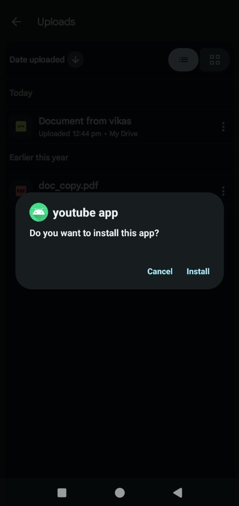
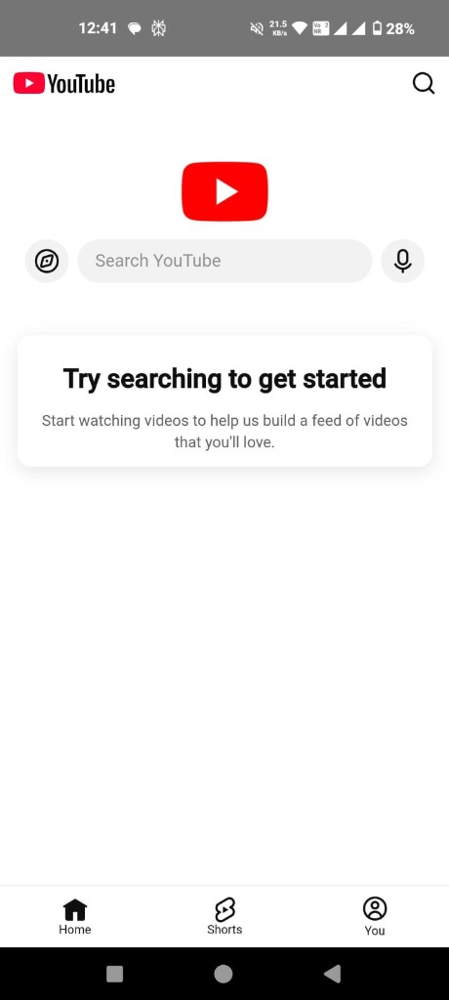

# YouTube Android Client

A high-performance Android application providing a native-feeling YouTube experience using Jetpack Compose and optimized WebView integration.

## Key Features
- **Native Navigation**: Integrated BackHandler supports deep navigation within the YouTube session, matching native app behavior.
- **Brand-Synchronized UX**: Custom-styled red progress indicators provide visual feedback during low-latency page loads.
- **Optimized Playback**: Configured with DOM storage and hardware-accelerated JavaScript for smooth 1080p+ streaming support.
- **Material 3 Design**: Built using the latest Android design tokens for a modern, premium aesthetic.

## Tech Stack
- **Architecture**: Jetpack Compose (Declarative UI)
- **Language**: Kotlin
- **Components**: Android WebView Interop, Material 3, AndroidX Core/Lifecycle
- **Build System**: Gradle (Kotlin DSL)

## How to Build & Run
1. Clone the repository and open in **Android Studio**.
2. Alternatively, build via CLI:
	```bash
	./gradlew assembleDebug
	```
3. Deploy to a connected device or emulator:
	```bash
	adb install -r app/build/outputs/apk/debug/app-debug.apk
	```

### Installation & App Preview
| Installation Dialog | Main App Interface |
| :---: | :---: |
|  |  |

## Project Structure
- `app/src/main/` — Primary application source and manifest.
- `app/build.gradle.kts` — Modular dependency management.
- `screenshots/` — Project visual documentation.

## License
Licensed under the [MIT License](LICENSE).
